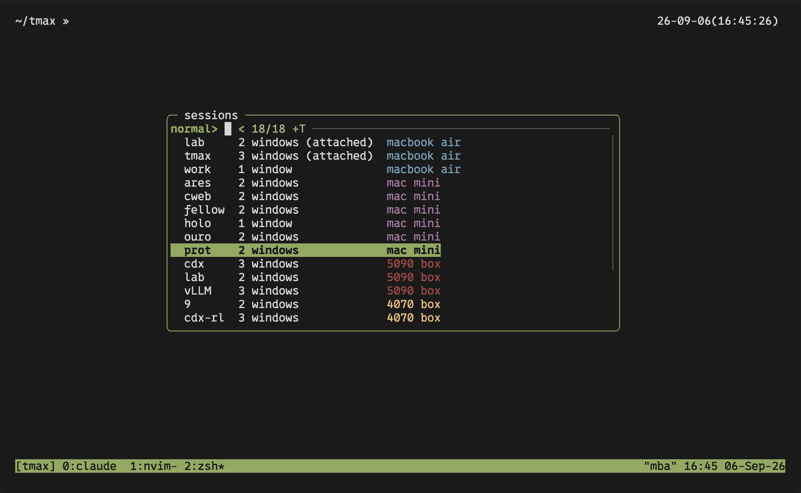

# tmax

QOL additions on top of tmux

tmax allows for a single deduplicated tmux server to be accessed across all your devices




## Status

Working and in daily use:

- **Session switcher** (`prefix + Space`): fzf popup, vim-style normal and
  insert modes, local and remote sessions in one list, hosts refreshed in the
  background, creates a session when nothing matches.
- **Remote sessions**: discovered over SSH and attached through tmux control
  mode. New windows, splits, layouts, zoom, window rename and confirmed
  pane/window kills are routed to the remote machine. Reconnects after a
  dropped link.
- **Native tree** (`prefix + s`): tmux's default session
  tree showing current local sessions.

Known limits of the remote bridge:

- Remote scrollback is not imported; copy-mode history starts when a pane is
  opened locally.
- Only the recognised bindings are translated. Commands typed at the `:`
  prompt act on the local proxy, not the remote machine.
- Each opened remote pane costs a small Python process and an SSH channel
  (one SSH transport per host). Listing sessions costs nothing.
- Exact restoration of every terminal mode and of mixed local/remote layouts
  is not guaranteed.

Requirements:

| Where  | Needs                                                        |
|--------|--------------------------------------------------------------|
| local  | tmux 3.3+, Python 3.9+, fzf 0.74.3+ (`brew install fzf`), macOS bash 3.2 is fine |
| remote | tmux 3.4+, Python 3.9+ for activity collection, and OpenSSH configured for key + account password |

Developed on macOS with tmux 3.4 locally and macOS/Linux hosts on tmux 3.4.

## Install

Add this line to `~/.tmux.conf`:

```tmux
run-shell ~/tmax/tmax.tmux
```

Then reload tmux:

```sh
tmux source-file ~/.tmux.conf
```

No plugin manager is needed. (It also works with TPM, which runs every
`*.tmux` file in a plugin folder.) Settings go **before** the `run-shell`
line; see [Options](#options).

For remote machines, copy `remotes.example.json` to `remotes.json` and edit
it; see [Remote computers](#remote-computers). A fresh checkout makes no
remote connections.

## Quick use

| Key               | Action                                                  |
|-------------------|---------------------------------------------------------|
| `prefix + Space`  | session switcher popup                                  |
| `prefix + s`      | tmux's default local session tree                      |

In the switcher: `j`/`k` move, `Enter` goes, `h` folds a host, `H` toggles all
remote hosts, `f` stars a session, `L` locks a host, `i` types a filter, and
`Esc` or `q` closes.
Remote sessions attach as you pick them. Once attached, they are ordinary tmux
sessions: `prefix + (` and `)`, the tree, and the switcher all move between
them.

## Session switcher

`prefix + Space` opens a large popup with an [fzf](https://github.com/junegunn/fzf)
list of every session, local and remote, in the spirit of
[tmux-fzf](https://github.com/sainnhe/tmux-fzf). Press `p` to open a preview of
the selected session's active window on the right half; it refreshes once a second. The preview starts hidden.

```
╭─ sessions ─────────────────────────────────╮
│ normal>                             11/11  │
│  ★ work              ● ●       laptop      │
│▌ ▾ laptop            ● ●       laptop      │
│    notes             ● ●       laptop      │
│  ▸ desk pc           ●         desk pc     │
│  ▾ gpu box           ●         gpu box     │
│    train             ● ●       gpu box     │
╰────────────────────────────────────────────╯
```

Sessions are grouped under one heading per computer. Starred sessions are
pinned above the groups. Local comes first, then each host in the order of
`remotes.json`. Both headings and session rows end with a computer-name badge
written in the terminal's own colour:
blue for local, then magenta, red and yellow for the hosts in order. On the
highlighted row the name takes the row's colour like the rest of the text.
The name is the entry's `label` in `remotes.json`, or the host key when
there is none; an optional `colour` (a tmux colour name, `colourN`, or
`#rrggbb`) overrides the palette. A `local` entry without a `destination`
names this machine:

```json
{
  "local": {"label": "laptop"},
  "desk":  {"destination": "desk", "tmux": "/opt/homebrew/bin/tmux", "label": "desk pc"},
  "gpu":   {"destination": "gpu-box", "tmux": "tmux", "label": "gpu box", "colour": "yellow"}
}
```

### Keys

The popup starts in a vim-like normal mode. Letters do nothing there except
the keys below, so `j` and `k` move without typing into the filter. Press
`i` (or `/`) for insert mode: type to filter on the session name, `Esc` goes
back to normal mode with the filter kept.

| Mode   | Key               | Action                                       |
|--------|-------------------|----------------------------------------------|
| normal | `j` `k` arrows    | move                                         |
| normal | `g` `G`           | first / last                                 |
| normal | `Ctrl-d` `Ctrl-u` | half page down / up                          |
| normal | `h`               | collapse / expand the current session's host |
| normal | `H`               | hide / show all remote hosts                  |
| normal | `f`               | star / unstar the current session             |
| normal | `p`               | show / hide the session preview               |
| normal | `i` `/`           | insert mode                                  |
| normal | `L`               | lock the selected remote host |
| normal | `Enter`           | unlock a locked host, or go to the session                            |
| normal | `q` `Esc`         | close                                        |
| insert | typing            | filter; `Ctrl-j` `Ctrl-k` still move         |
| insert | `Backspace`       | edit the filter                              |
| insert | `Enter`           | go to the session; with no match, create a local session named after the text |
| insert | `Esc`             | back to normal mode                          |

Remote sessions connect when selected. (Their local proxies are still named
`host/session` in the native tmux tree.)

### Agent activity dots

The middle column uses one dot per **window** on a session row and one dot
per **session** on a host row, in window-index and session-name order.

- **White:** no agent running.
- **Green:** an agent is working.
- **Yellow:** an agent is waiting for a prompt, answer, approval, or usage reset.

Waiting takes priority over working, which takes priority over an ordinary
terminal. The same rule combines multiple panes within a window and multiple
windows within a session. For example, a shell, working Claude Code, and
waiting Codex produce white/green/yellow dots on the session row and one
yellow dot on the host row. Collapsing hosts and starring sessions do not
change the aggregate. Locked hosts retain their `locked` label; disconnected
hosts do not claim live agent activity.

Dots refresh while the popup stays open, including when the selected row
does not change. Dots use bright white, green, and yellow, including on the
highlighted row. Highlighted text, including the host label, is black;
unselected host labels retain their host colours.

Install the collector and integrations on each machine that runs agents:

```sh
python3 scripts/install-agent-status.py
# From local tmux, after unlocking a configured remote:
python3 scripts/install-agent-status.py --host laptop
```

Installation preserves existing settings and hooks and backs up changed JSON
files. Restart Claude Code, Codex, and Pi to load their integrations.
**Review and trust the new hooks in Codex's `/hooks` UI**; tmax never changes
Codex hook trust settings.

Claude Code and Codex lifecycle hooks report prompt submission, tool use,
approval requests, and completion. Pi uses agent lifecycle and blocking UI
events. These reporters observe state only: they do not approve tools, change
prompts, or store conversation text. See the official
[Claude Code hooks](https://code.claude.com/docs/en/hooks),
[Codex hooks](https://learn.chatgpt.com/docs/hooks), and
[Pi extension events](https://pi.dev/docs/latest/extensions).

Already-running agents without loaded hooks use a
best-effort fallback: tmax identifies an agent process and reads its current
terminal status lines. It never infers “working” merely from terminal output
or CPU activity. An identified agent with no working indicator is shown as
waiting. This fallback can misclassify unfamiliar agent UIs; hooks give more
precise transitions. Dead processes and reused PIDs cannot retain old hook
state. Codex desktop sessions outside tmux are not window activity.

Remote collection runs on the remote machine through the existing approved
SSH master, returning only window states. Remote terminal text stays there.
The collector respects custom remote tmux executables and named sockets.

### Behaviour

The list appears at once with what tmux already knows: local sessions and
the remote ones seen before. The configured hosts are then refreshed in the
background while the popup is open. The list is reloaded only if something
changed, keeping the cursor on the same session. Hosts that are offline keep their cached
entries. Polling runs every two seconds after a one-second pause in navigation; remote round trips
add latency and never block typing.

The top-right status lists every configured remote host: `●` is connected,
`◌` is checking, `○` is offline, and a yellow `●` means locked. It updates when the background refresh
finishes; the normal fzf match count follows the host statuses.

Pressing `h` in normal mode collapses the host under the cursor to its one-line
heading, or expands it again. `Enter` does the same on a host heading. Press
`H` to hide or show every remote host. These choices are remembered for later
openings. Set `@tmax-switch-hosts` to `off` to start with only local sessions.

Press `f` on any local or remote session to star it. Starred sessions move to
the top of the switcher and stay visible even when their host group is
collapsed; press `f` again to unstar them. Collapse and favorite state is kept
in `$TMAX_STATE_DIR/switcher.json`.

The popup has rounded corners. Its border and the highlighted line use the
colours of your status bar (`status-style`); the title is white. A status
bar without a background colour leaves the border in the default colour.

Without fzf the key shows a short message in the status line. This binding
replaces tmux's default `prefix + Space` (`next-layout`); that command is
still available from the `:` prompt or by binding another key.

Options, in `~/.tmux.conf` before the `run-shell` line:

```tmux
set -g @tmax-switch-key    "Space"  # prefix + key
set -g @tmax-switch-width  "75%"    # popup size, columns or percent
set -g @tmax-switch-height "65%"
set -g @tmax-switch-hosts  "on"     # show remote-host sessions initially
```

## Remote computers

Hosts are entirely user-configured in `remotes.json` next to `tmax.tmux`
(ignored by Git). Copy `remotes.example.json` and edit it:

```json
{
  "local": {"label": "this machine"},
  "laptop": {
    "destination": "user@laptop",
    "tmux": "/opt/homebrew/bin/tmux",
    "label": "laptop"
  },
  "server": {"destination": "server", "tmux": "tmux", "label": "big server", "colour": "red"}
}
```

| Field          | Meaning                                                            |
|----------------|--------------------------------------------------------------------|
| `destination`  | what `ssh` gets; normal SSH configuration applies. Without it the entry is not a host (used for `local`) |
| `tmux`         | path of the tmux executable on that machine                        |
| `socket`       | optional; selects a nondefault tmux server there                   |
| `label`        | name shown in the session switcher; defaults to the key            |
| `colour`       | colour of that name; defaults to the palette                       |

Set `TMAX_REMOTES_FILE` in the local tmux environment to use a different
JSON file. An empty object disables remote hosts.

### Password unlocks

Each remote host starts locked. Select its heading in the popup and press
`Enter` to unlock it with that machine's account password. OpenSSH reads the
password directly in the terminal; tmax never saves it. A host must require
both your SSH key and its account password. Key-only and password-only
authentication are rejected.

Configure each destination once from a regular terminal:

```sh
python3 scripts/setup-host.py laptop
python3 scripts/setup-host.py server
```

Use the keys from your own `remotes.json`. The command connects over SSH and
asks for the remote sudo password. It installs a policy for the SSH user,
validates the configuration before and after installation, keeps a backup,
and reloads SSH on Linux. macOS reads the new policy for new connections.
Keep a working connection open until a fresh login succeeds. The command
prints the backup path and rollback instructions. Review
`scripts/configure-ssh.sh` for the exact server change.

Once unlocked, discovery and remote panes share one private SSH master.
The host locks again when the connection dies, after a reboot, or **24 hours
after authentication**, including time asleep. Activity does not extend the
deadline. Sleep alone does not lock a still-valid connection. Press `L` on
a remote host or one of its sessions to lock it immediately. Remote tmux
sessions continue running when the transport closes.

No background command can fall back to a fresh key-based SSH login.
Previously configured external `control_path` sockets are no longer used.

The 24-hour deadline is enforced by a local watchdog and lease checks, not
by `ControlPersist` (which is an idle timeout). This is not a server-enforced
maximum session lifetime: someone controlling the local account can disable
the watchdog, use an open connection, or capture a newly entered password.
The destination's key-plus-password policy prevents fresh key-only logins,
but cannot undo access or persistence established while authenticated.
Apply that policy on every machine that accepts incoming SSH if you want
the requirement in both directions.

### How it works

Remote sessions appear locally as proxy sessions named `host/session` (the
host key, then the remote session name; they follow remote renames). Until
selected, a proxy is a lightweight placeholder. Selecting it connects its
windows and panes through tmux control mode over SSH. There is one local
status bar and one local prefix; the remote machine keeps its own tmux
configuration and running programs. Agent activity uses the small collector
and hooks installed in your remote user account.

Recognised bindings for new windows, splitting, pane/window deletion, window
renaming, zoom and layouts are routed to the remote machine. Navigation,
copy mode, paste, and the switcher stay local. Window rename uses
a small prompt popup. Custom bindings and commands typed at the tmux `:`
prompt are **not** translated; use the routed keys for remote creation and
deletion. Deleting a proxy through a direct local tmux command only removes
the local copy, and the synchroniser may recreate it.

Hidden panes keep their output subscriptions active so their local screen and
scrollback remain intact when you return, without blocking remote programs.
Opened sessions reconcile their windows and panes every 5 seconds while attached (15
seconds while detached). A lost SSH master requires another unlock; keystrokes
typed while disconnected are discarded. If a host runs tmax itself, its own proxy
sessions (for example the ones it holds for this machine) are skipped, so
nothing shows up twice.

Diagnostics go to `remote.log` in the private `tmax-UID-HASH` directory under
`/tmp`.

## Native session tree

`prefix + s` opens tmux's default session tree (`choose-tree -Zs`) with current local sessions,
without discovering remote sessions. Already-created local proxies for remote
sessions still appear as `host/session` entries. Use `prefix + Space` to
browse and connect to remote sessions.

## Options

Put these in `~/.tmux.conf` **before** the `run-shell` line. Defaults shown.

```tmux
# switcher
set -g @tmax-switch-key    "Space"
set -g @tmax-switch-width  "75%"
set -g @tmax-switch-height "65%"
set -g @tmax-switch-hosts  "on"     # H toggles all remote-host sessions
```

Environment variables (set with `tmux set-environment -g`): `TMAX_REMOTES_FILE`
(hosts file) and `TMAX_STATE_DIR` (switcher preferences and state).

## Files

```
tmax.tmux              entry point: key bindings and hooks
scripts/remote.py      remote hosts over SSH control mode; the fzf session switcher
scripts/auth.py        password-approved SSH masters and 24-hour expiry
scripts/agent_status.py  lifecycle hooks and per-window activity collection
scripts/install-agent-status.py  merge agent integrations on this machine
integrations/pi-status.ts  Pi lifecycle extension
scripts/setup-host.py  interactive server policy setup
scripts/configure-ssh.sh  validated key-plus-password SSH policy
remotes.example.json   template for remotes.json
test/                  throwaway-server tests (see below)
```

## How a tmux plugin works

- A plugin is a folder with one `*.tmux` file at the top.
- That file is a normal shell script. tmux runs it once at start.
- The script calls `tmux bind-key`, `tmux set-option`, `tmux set-hook`.
- Key bindings point to helper scripts in `scripts/`.
- State is kept in tmux user options. They start with `@`.

## Debug

Remote diagnostics are in `remote.log` in the private `tmax-UID-HASH`
directory under `/tmp`.

## Test

Each test starts its own throwaway tmux server and never touches yours.

```sh
python3 test/agent_status_test.py  # lifecycle, aggregation, remote states, pane cleanup
python3 test/live_activity_popup_test.py  # visible dot changes in an open popup
python3 test/auth_test.py       # authentication, expiry, reboot, fail-closed behavior
python3 test/password_popup_test.py  # interactive unlock/lock/cancel with fake SSH
python3 test/switch_test.py     # prefix + Space popup: modes, filter, create, cancel
```

The remote integration suite creates and removes its own tmux servers on
both ends. Run it in a terminal against a host configured for key + password;
it prompts once for the account password:

```sh
python3 test/remote_integration_test.py --host user@test-host
# For an executable outside the remote SSH PATH:
python3 test/remote_integration_test.py --host user@laptop \
  --tmux /opt/homebrew/bin/tmux
```

It checks popup selection, the local session tree, interactive input/output,
remote windows/splits/zoom, hidden output, reconnection, Vim restoration,
confirmed pane deletion, and cleanup of ended sessions. Existing remote sessions are not targeted.
